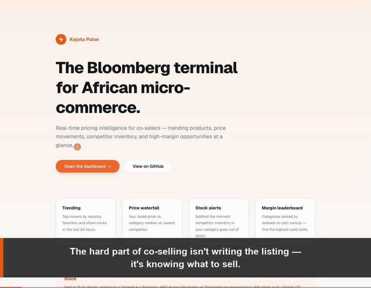

# Kajota Pulse

> Real-time pricing intelligence for African co-sellers — see trending products, price movements, competitor inventory, and high-margin opportunities at a glance.

**🟢 Live:** https://kajota-pulse.vercel.app — the dashboard reads live from AWS Aurora (green "Live · Aurora" badge).



> Above: a captioned ~80s walkthrough against the **live** deployment — title cards, the `Live · Aurora` badge + stack, the Gemini **"Ask the advisor"** buy-list (with structured-output + heuristic-fallback notes), "Explain why", a tour of each card (Trending · Price waterfall · Stock alerts · Margin leaderboard), the live MongoDB-Atlas-trigger ingestion, and the passwordless-IAM zero-stack architecture.
> ▶ MP4: [`docs/media/kajota-pulse-demo.mp4`](docs/media/kajota-pulse-demo.mp4) · 🎙️ 3–5 min narrated script: [`docs/DEMO.md`](docs/DEMO.md) · ✍️ build write-up (published content): [`docs/BLOG.md`](docs/BLOG.md)

**Hackathon submissions:**
- **AWS / Vercel — Hack the Zero Stack** (Jun 29, $80K). Built on the prescribed stack: Vercel (Next.js) + shadcn/Tailwind UI + **AWS Aurora Serverless v2 (Postgres)** for the data layer.
- **XPRIZE Build with Gemini** (Aug 17). Pulse becomes the third pillar of the **Kajota AI Stack** — Coach drafts, Pulse monitors, Mesh settles. Gemini 2.5 Flash powers both the **"What should I stock this week?" advisor** (`/api/recommend`) and the per-product "Explain why it's trending" analyst (`/api/explain`).

**Sibling repos** (KaJota-inc org, all private):
- [`kajota-coach`](https://github.com/KaJota-inc/kajota-coach) — single-shot AI listing pipeline (Coach v1)
- [`kajota-mobile-backend`](https://github.com/KaJota-inc/mobile-backend) — Spring Boot backend, hosts Coach Agent v2 (`/ai/coach/agent/chat`) and the Mesh on-chain attestation hook (`/ai/coach/agent/shipment-attestation`)
- [`kajota-mesh`](https://github.com/KaJota-inc/kajota-mesh) — Web3 escrow + settlement contracts on Ethereum Sepolia

---

## What problem this solves

Across emerging-market e-commerce, micro-retailers ("co-sellers") buy stock from wholesalers and resell to their personal network for a markup. **The hardest part of running this business isn't drafting listings** (Coach handles that) — **it's knowing what to sell**.

Today the co-seller has no visibility into:
1. Which products are trending across the marketplace
2. Whether their price is competitive vs. similar listings
3. When a competitor's hot item goes out of stock (their window to capture demand)
4. Which categories carry the highest co-sell margin

Pulse closes those four gaps. It's the **"Bloomberg terminal for African micro-commerce"** — a single dashboard the seller checks before they sit down for the day.

## Architecture (as built)

```text
   Kajota Mongo Atlas (production)         seller's browser
   products·cosellproducts·orders                 │
              │                                    ▼
              │ Atlas Trigger              ┌──────────────────────────┐
              │ POST changeEvent           │  Vercel — Next.js 16     │
              ▼                            │  App Router (Lambda)     │
   ┌────────────────────────┐             │  /dashboard · /api/*     │
   │ POST /api/ingest       │             └────────────┬─────────────┘
   │ (X-Pulse-Ingest-Secret)│                          │ IAM auth token
   │ upserts → Postgres     │──────┐                   │ (@aws-sdk/rds-signer)
   └────────────────────────┘      ▼                   ▼
                       ┌───────────────────────────────────────────┐
                       │  AWS Aurora Serverless v2 (Postgres)      │
                       │  products·price_snapshots·stock_events·   │
                       │  engagement_events·cosell_listings        │
                       │  + views v_trending_24h, v_latest_stock   │
                       └───────────────────────────────────────────┘
   Gemini 2.5 Flash ── POST /api/explain ── "why is this trending?" (XPRIZE)
```

**Why this stack:**
- **AWS Aurora Serverless v2 (Postgres)** — scales to zero on idle, full SQL for the joins / aggregates / window functions behind the trending + waterfall + leaderboard cards. The cluster runs the new internet-access-gateway networking model, so Vercel reaches it directly over TLS — no VPC plumbing.
- **IAM database authentication (no stored passwords).** This Aurora model *requires* IAM auth, so each connection mints a short-lived IAM token via `@aws-sdk/rds-signer` (pg async-password callback). Credentials are read from `PULSE_AWS_*` env vars and passed explicitly to the signer so Vercel's Lambda execution-role creds can't shadow them. Net: zero long-lived DB passwords anywhere.
- **Vercel (Next.js 16 App Router)** — `/dashboard` is a dynamic server component; `loadDashboard()` auto-serves live Aurora data when configured, falling back to a polished mock so the demo never hard-fails.
- **Atlas Triggers → `/api/ingest`** — no polling; Pulse only does work when the Kajota catalogue actually changes (`docs/atlas-trigger.js`).
- **Gemini 2.5 Flash** — `/api/explain` reads a product's live trend signals and returns a 2-3 sentence explanation + next action for the seller.

## Day-1 dashboard views

1. **Trending products** — top movers by velocity / favorites / share-clicks in the last 24 h
2. **Price waterfall** — your listed price vs. category median vs. lowest competitor
3. **Stock alerts** — competitor inventory just went out-of-stock in a category you sell in
4. **Margin leaderboard** — categories ranked by realised co-sell markup

Each card is a Vercel v0 generation, refined by hand. Recharts handles the visualisations.

## Running locally

```bash
git clone https://github.com/KaJota-inc/kajota-pulse.git
cd kajota-pulse
cp .env.example .env.local   # fill in DATABASE_URL + KAJOTA_API_BASE_URL
npm install
npm run dev
```

The dashboard works against a local Postgres for development and against Aurora Serverless v2 in production.

## Why this is hackathon-grade

- **Real catalogue, not toy data.** Pulse reads from the live Kajota Mongo cluster via Atlas Triggers.
- **Closes the trinity.** Existing apps: Coach (draft) + Mesh (settle). Pulse is the missing **monitor** layer — together they cover the whole co-sell workflow.
- **Demonstrates a different skill from Coach.** Coach is LLM orchestration. Pulse is real-time data + analytics + dashboard design — same team, different muscle.
- **Optional Gemini layer.** For the XPRIZE submission, Pulse cards include an "Explain why" button that calls Gemini to summarise *why* a product is trending. Gives Pulse a clean Gemini integration story without bloating the day-1 build.

## Repo map (initial scaffold)

```
src/
  app/
    page.tsx                  — landing
    dashboard/
      page.tsx                — main Pulse dashboard
    api/
      ingest/route.ts         — Atlas-Trigger endpoint (Lambda-compatible)
  components/
    ui/                       — shadcn/ui primitives (added with the v0 generations)
    pulse/                    — Pulse-specific cards: TrendingCard, PriceWaterfall, …
  lib/
    db.ts                     — Aurora client wrapper
    kajota.ts                 — Kajota backend client (Coach + Mesh handoff)
    types.ts                  — Pulse data shapes (mirrored from Mongo)
docs/
  architecture.md             — file-level map + ingestion pipeline
  schema.sql                  — Aurora schema (DDL)
```

## Roadmap

- **W1 (May 18–24)** — scaffold + first v0-generated dashboard skeleton; mocked data
- **W2 (May 25–31)** — Aurora schema, Lambda ingestion, real data behind the cards
- **W3 (Jun 1–7)** — auth (Kajota JWT), seller-scoped views, deploy to Vercel
- **W4 (Jun 8–14)** — Gemini "Explain why" integration for XPRIZE story
- **W5–6 (Jun 15–28)** — polish, demo video, H0 submission (Jun 29)
- **W7+ (Jul–Aug)** — XPRIZE polish (unified Kajota AI Stack pitch)

## License

MIT — see [`LICENSE`](LICENSE).
